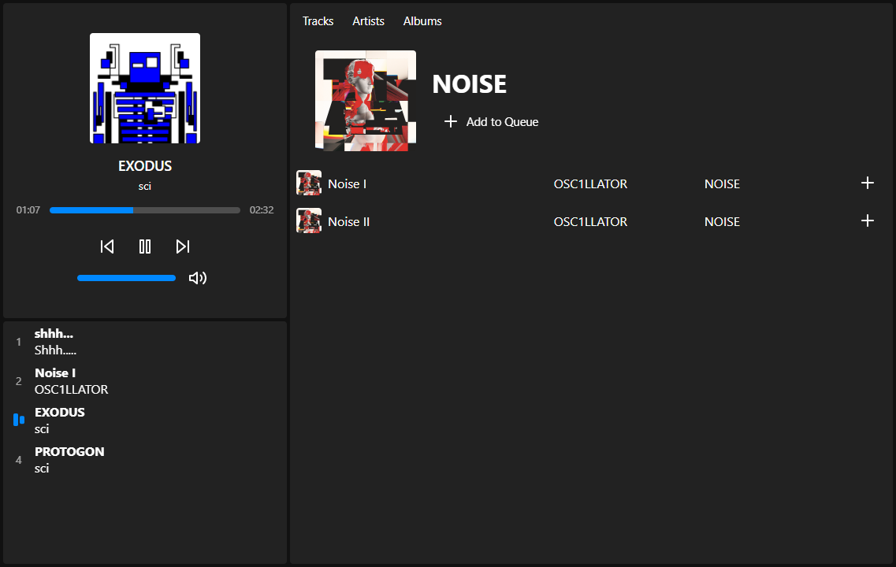

# Flerovium

A simple audio player built with React & Redux.

## Features

* Audio playback control (play, pause, ...)
* Track queue
* A simple track library with separate Tracks, Artists and Albums tabs

## Space for Improvement

This is just a quick little project I've made to learn the basics of React Redux. If it were to become a more fully-featured audio playback app, it would need at least:

* A more sophisticated library (searching, filtering by genre, custom playlists)
* ID3 tag extraction from audio files for auto-filling track info (artist, album, cover art)
* An improved queue with repeat and shuffle controls
* Visualizations in sync with audio (MilkDrop, anyone?)